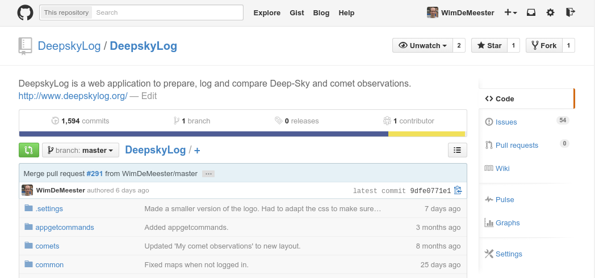
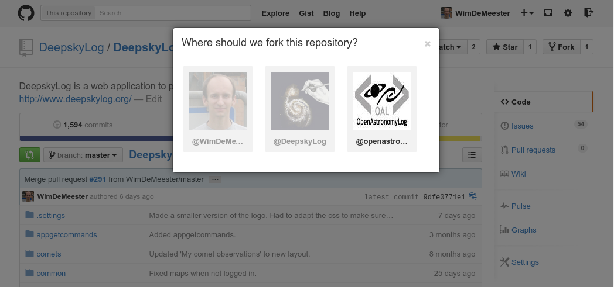
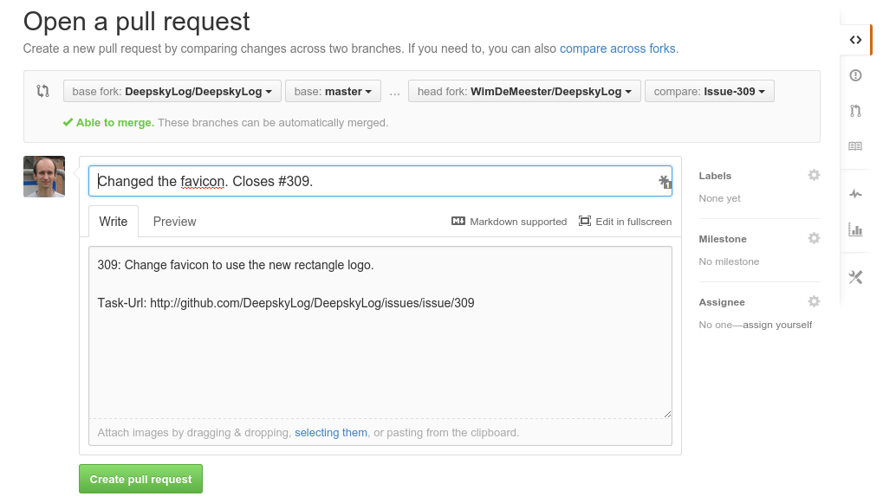
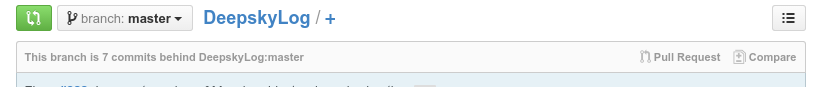
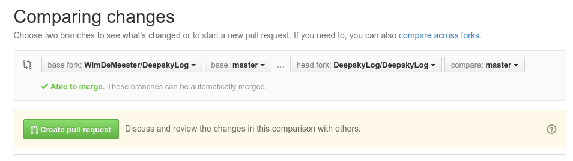

# Setting up the development environment on Windows.

## Install eclipse

+ Download eclipse from  http://eclipse.org/downloads/. Select 'Eclipse for PHP developers'.
+ Install eclipse.

## Setting up eclipse

+ Start eclipse.
+ Select a location for your Workspace.

### Install GitHub plugin
+ First update your eclipse. Select `Help`-`Check for Updates`. It is important to have all the latest updates, because without these updates, the needed plugins cannot be installed. Restart eclipse after the updates are installed.
+ Select `Help`-`Eclipse Marketplace`
+ Search for GitHub Extensions.
+ Install GitHub Extensions.
+ Also install GitHub Flavored Markdown viewer plugin in the same way.
+ Select `Help`-`Install New Software...`
+ Enter `http://download.eclipse.org/egit/github/updates/` in the 'Work with' field.
+ Select `Collaboration` and click `Next` to install the GitHub plugins.
+ Restart Eclipse after the installation of the plugins.

### Download the DeepskyLog sourcecode
+ First make sure to fork DeepskyLog in GitHub. In your browser, go to `https://github.com/DeepskyLog/DeepskyLog/` and click the fork button.

 

+ You will be asked where to fork this repository. Select your own account (for example ChrisWauters).

 

+ In eclipse, select `File`-`Import`.
+ Select `Projects from Git`.
+ Select `Clone URI`.
+ Enter the link tou your personal GitHub fork of DeepskyLog. For example: `https://github.com/ChrisWauters/DeepskyLog/`. Also enter your GitHub Username and Password. Click `Next`. 
+ Select the master branch and click `Next` again.
+ Select a location where to store the sourcecode (for example `\Users\wim\git\DeepskyLog`) and click Next.
+ Select `Import using the New Project wizard` and select `Finish`.
+ Select `PHP project`.
+ Enter a project name, for example `DeepskyLog`.
+ Select `Create project at existing location (from existing source)`. Enter the directory where the source code is: `\Users\wim\git\DeepskyLog\`.
+ Click `Finish`.

### Add GitHub Task List in eclipse
+ Select `Window`-`Show View`-`Other...`. Select `Task Repositories`.
+ Right click in the `Task Repositories` view and select `Add Task Repository...`.
+ Select `GitHub Issues`.
+ Enter `https://github.com/DeepskyLog/DeepskyLog/` in the Server field. Also add your GitHub User ID and password. Press `Finish`.
+ You will get the question: `Would you like to add a query to the Task List for this repository?`. Answer `Yes`.
+ Enter the title `Open Issues`. Click `Finish`.
+ To view the Issues, select `Window`-`Show View`-`Task List`.

## Run DeepskyLog

### Downloading the sourcecode

+ Download and install the GitHub software: https://windows.github.com/
+ Start the GitHub software
+ Go to the Options page (the wheel at the right top side of the window)
+ Click 'Add Account'

+ Enter your credentials and click 'Log In'

+ Click on the 'Plus' sign at the left top side of the window. Select 'Clone'.

+ Clone DeepskyLog / Docker

+ You will see that the Docker repository is being cloned.

### Setting up the test environment

+ Download and install boot2docker. In the install options, also select VirtualBox: https://github.com/boot2docker/windows-installer/releases
+ Start up boot2docker (by Double clicking the icon on the Desktop)

### Making the mysql Data Volume container
+ Switch to the directory with the Docker source code:
`cd Documents\GitHub\Docker\`
+ Make the container:
`docker build -t="mysql:v5.0" mysql-container`

### Run the Data Volume container
`docker run -d --name mysql mysql:v5.0 tail -f /dev/null`

### Making the DeepskyLog container
`docker build -t deepskylog:v5.0 .`
This will take a long time, so be patient. It only has to executed one time, so this is not problematic.

### Running the DeepskyLog container
`docker run -v \Users\wim\Documents\GitHub\DeepskyLog\:/var/www/html --volumes-from mysql -t -p 80:80 -p 3306:3306 deepskylog:v5.0`

Change `\Users\wim\Documents\GitHub\DeepskyLog\` with the location of the DeepskyLog source code.

### Find out the IP address of the webserver for DeepskyLog
`boot2docker ip`

### Make DeepskyLog work with the docker containers

In Eclipse, copy `DeepskyLog/lib/setup/databaseInfo.php.dist` to `databaseInfo.php` and enter the correct ip address in the following line:

`$baseURL      = "http://192.168.59.103/";`

## Test DeepskyLog

+ Before you can run DeepskyLog locally on your Windows machine, make sure that you startup `boot2docker` and start up the docker container for DeepskyLog: 
`docker run -v \Users\wim\Documents\GitHub\DeepskyLog\:/var/www/html --volumes-from mysql -t -p 80:80 -p 3306:3306 deepskylog:v5.0`
+ You can now test the developer version of DeepskyLog in your browser. Point to the IP address you used in the steps above: http://192.168.59.103/.
+ Make sure to update the source code of DeepskyLog once in a while. To do this, right click `DeepskyLog` in the `PHP Explorer` of eclipse and select `Team`-`Synchronize`..

## Develop for DeepskyLog

### Create a new branch

+ For each issue you work on, create a new branch in Eclipse.
+ Right click on `DeepskyLog` in the PHP explorer, select `Team`-`Switch To`-`New Branch...`.
+ Add a branch name, for example `issue-309`. Select `Configure upstream for push and pull`. Click `Finish`.
+ The new branch will be checked out in Eclipse. You will see this in the `PHP Explorer`.

### Develop and commit

+ Start fixing the selected issue. Whenever you have changed something, commit the changes by right clicking and selecting `Team`-`Commit`.
+ When the issue is fixed, you can close the issue automatically in GitHub when you add in the message of the commit something like `Closes issue #309`.
+ When the issue is fixed, also push your branch to the server. Do this by right clicking  and selecting `Team`-`Push Branch 'Issue-309'`.

### Create a pull request to include your changes into the official DeepskyLog release

+ Go to the DeepskyLog repository on your GitHub page, for example: `https://github.com/ChrisWauters/DeepskyLog/`. 
+ You will see `branch: master`.

+ Click this button and select the branch you have used for your development. You will see something like this:

+ Click `Pull Request`. Add a title describing what this does:

+ Click `Create pull request`.

### Next steps

+ Before working on a new issue, switch back to the `master` branch in Eclipse. 
+ In your local GitHub repository (https://github.com/ChrisWauters/DeepskyLog), you can see if your master is in sync with the real DeepskyLog master. You will see something like this:

If you see `This branch is x commits behind DeepskyLog:master`, you will need to pull the changes from DeepskyLog/DeepskyLog to your own repository.
+ Click `Pull request`.
+ Click `Try switching the base`
+ You will see the changes, something like this:

+ Click `Pull request`.
+ Add a title, for example: `Bringing up to date with master`.
+ Press `Create pull request`.
+ Press `Merge pull request`.
+ Press `Confirm merge`. 
+ Pull all changes so that you work against a recent version of DeepskyLog. Right click `DeepskyLog` in the `PHP Explorer`. Select `Team`-`Pull`.
+ Now you can start all over. First, create a new branch and start developing.
