# Test DeepskyLog using a Mac

This document describes how to set up your environment to be able to test the developer version of DeepskyLog locally on your Mac.

## Downloading the sourcecode

+ Download and install the GitHub software: https://mac.github.com/
+ Start the GitHub software.
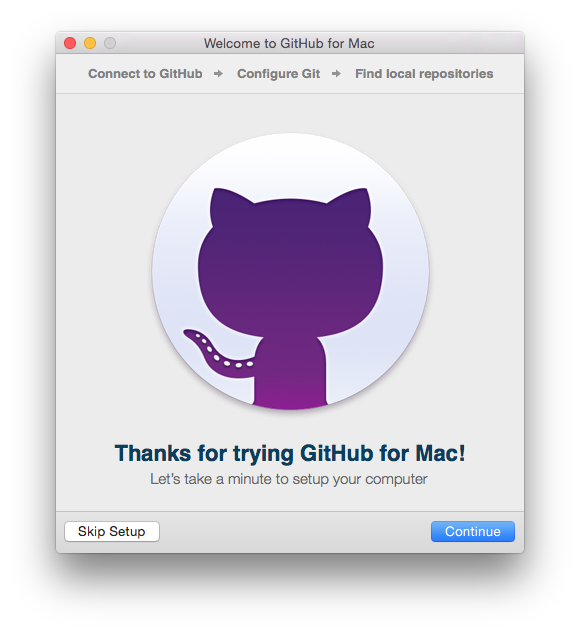
+ Enter your GitHub user name and password and Sign in.
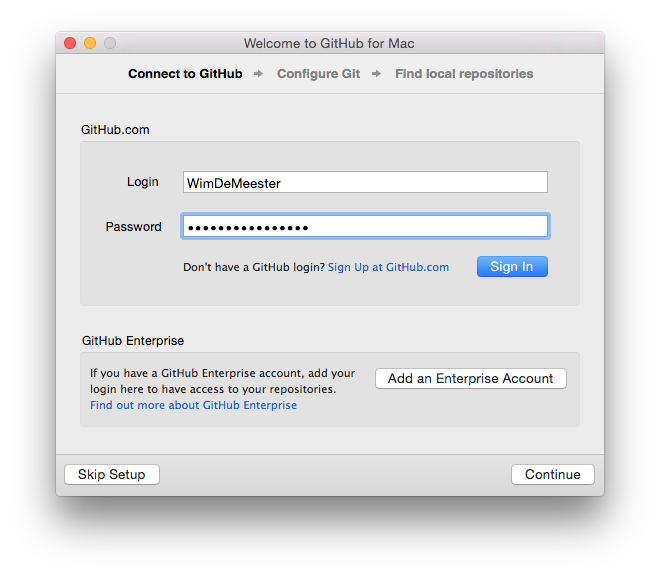
+ Configure git. Enter your name and mailaddress.
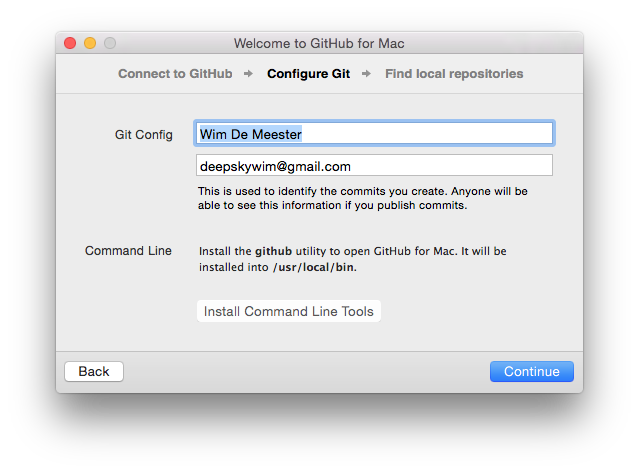
+ Click next on the page with the local repositories.
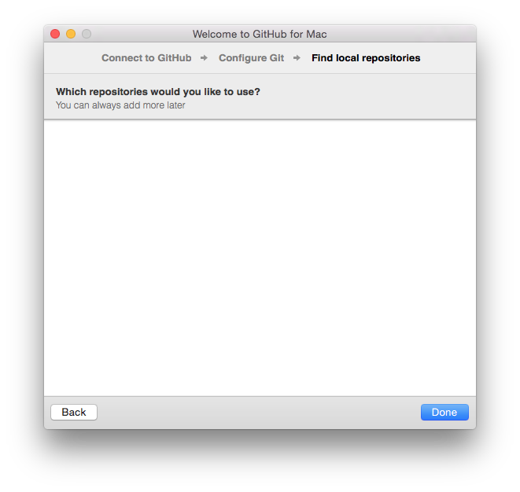
+ Click on the 'Plus' sign at the left top side of the window.
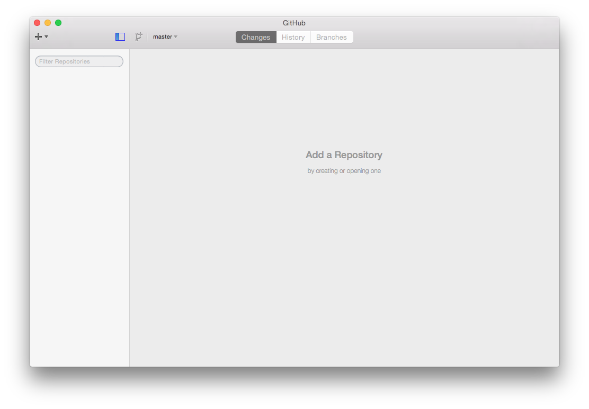
+ Select 'Clone'.
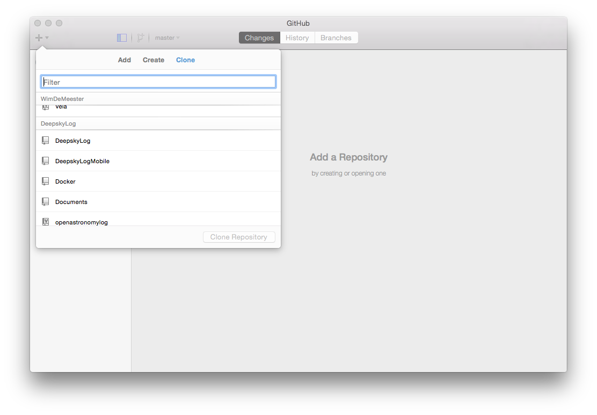
+ Clone DeepskyLog / Docker
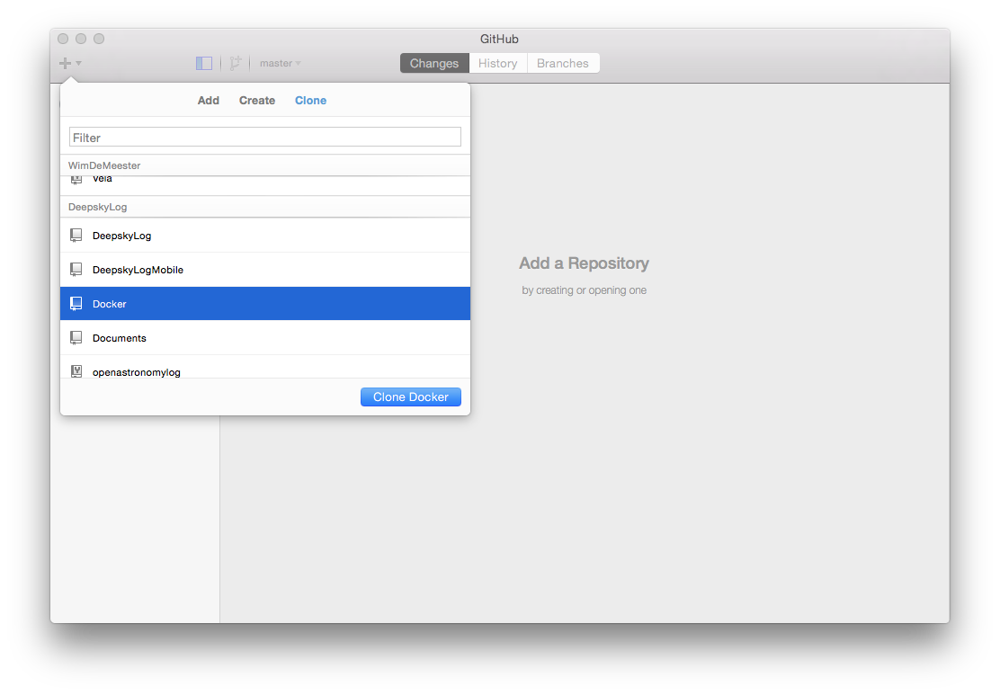
+ Select the directory where you want to have the Docker source code cloned.
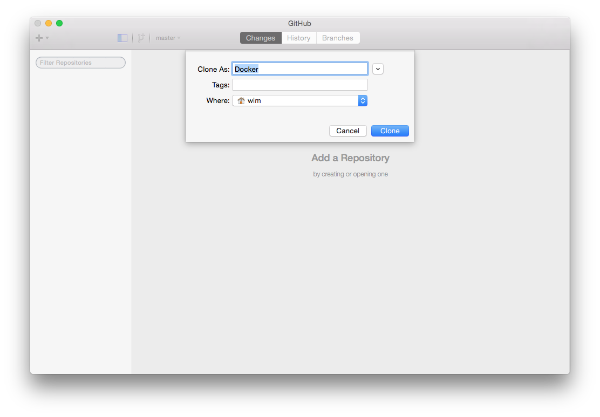
+ You will see that the Docker repository is being cloned.
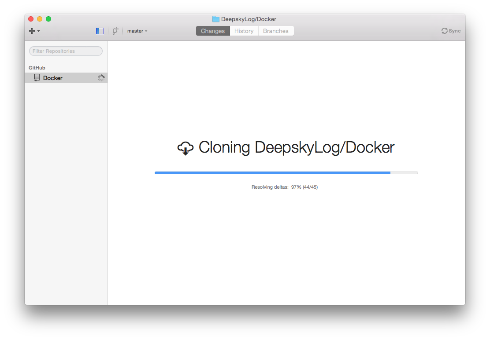
+ Click again on the 'Plus' sign at the left top side of the window and clone DeepskyLog / DeepskyLog.
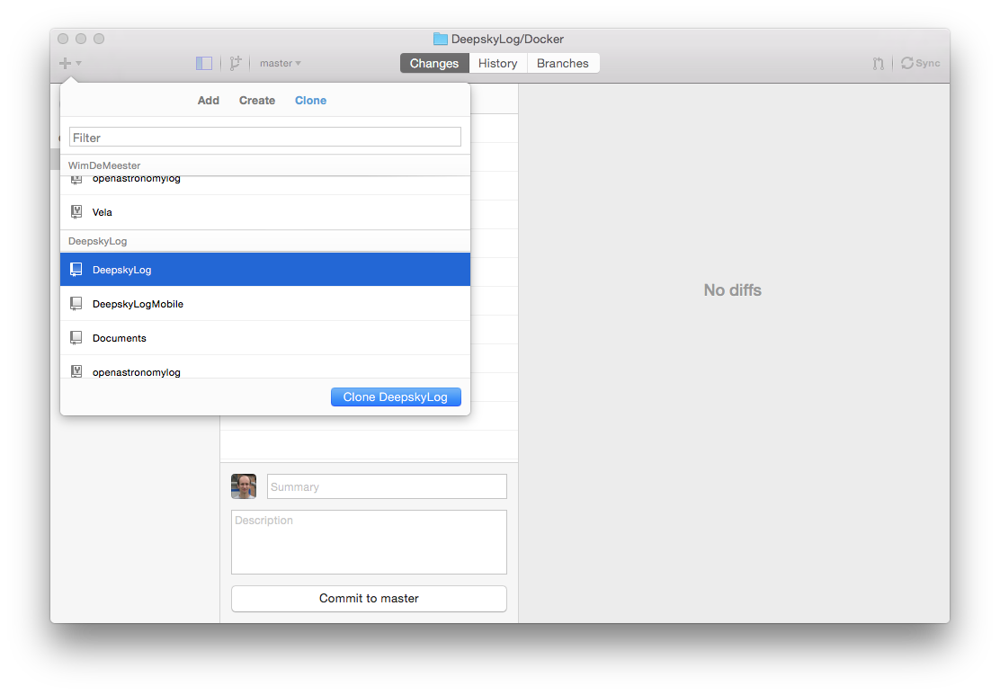
+ Select the directory where you want to have the DeepskyLog source code cloned.
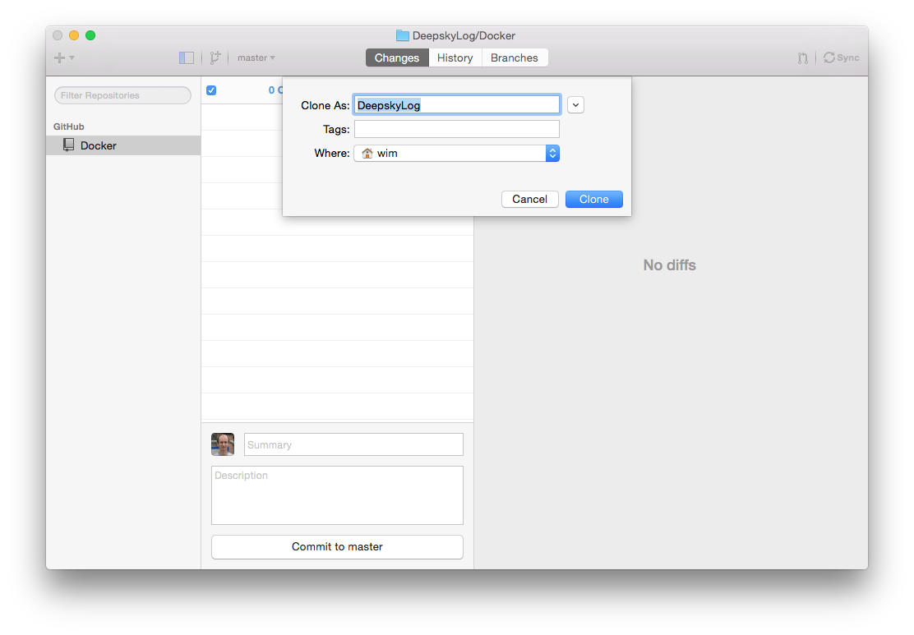
+ You will see that the DeepskyLog repository is being cloned.
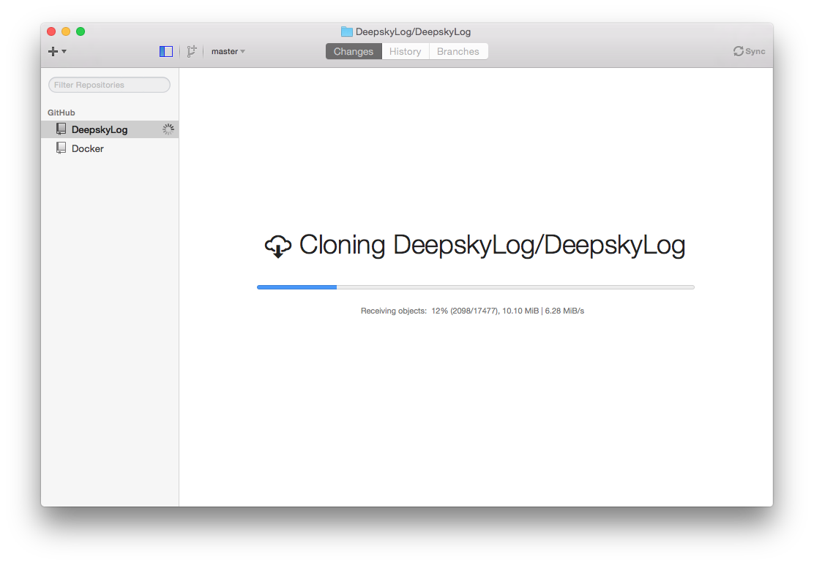

## Setting up the test environment

+ Download and install boot2docker: https://github.com/boot2docker/osx-installer/releases
+ Start up boot2docker.

## Making the mysql Data Volume container
+ Switch to the directory with the Docker source code:
`cd Docker`
+ Make the container:
`docker build -t="mysql:v5.0" mysql-container`

## Run the Data Volume container
`docker run -d --name mysql mysql:v5.0 tail -f /dev/null`

## Making the DeepskyLog container
`docker build -t deepskylog:v5.0 .`
This will take a long time, so be patient. It only has to executed one time, so this is not problematic.

## Running the DeepskyLog container
`docker run -v /Users/wim/DeepskyLog/:/var/www/html --volumes-from mysql -t -p 80:80 -p 3306:3306 deepskylog:v5.0`

Change `/Users/wim/DeepskyLog/` with the location of the DeepskyLog source code. If you used the default settings of the GitHub client, you will only need to change the username.

## Find out the IP address of the webserver for DeepskyLog
`boot2docker ip`

## Make DeepskyLog work with the docker containers

In `DeepskyLog/lib/setup/`, copy the file `databaseInfo.php.dist` to `databaseInfo.php` and enter the correct ip address in the following line:

`$baseURL      = "http://192.168.59.103/";`

## Test DeepskyLog

+ Before you can run DeepskyLog locally on your Windows machine, make sure that you startup `boot2docker` and start up the docker container for DeepskyLog: 
`docker run -v /Users/wim/DeepskyLog/:/var/www/html --volumes-from mysql -t -p 80:80 -p 3306:3306 deepskylog:v5.0`
+ You can now test the developer version of DeepskyLog in your browser. Point to the IP address you used in the steps above: http://192.168.59.103/.
+ Make sure to update the source code of DeepskyLog once in a while. To do this, start up your GitHub client, select DeepskyLog and click 'Sync' (at the top right).
