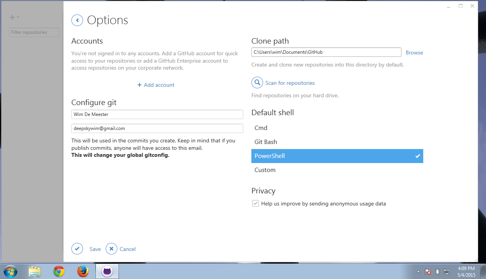
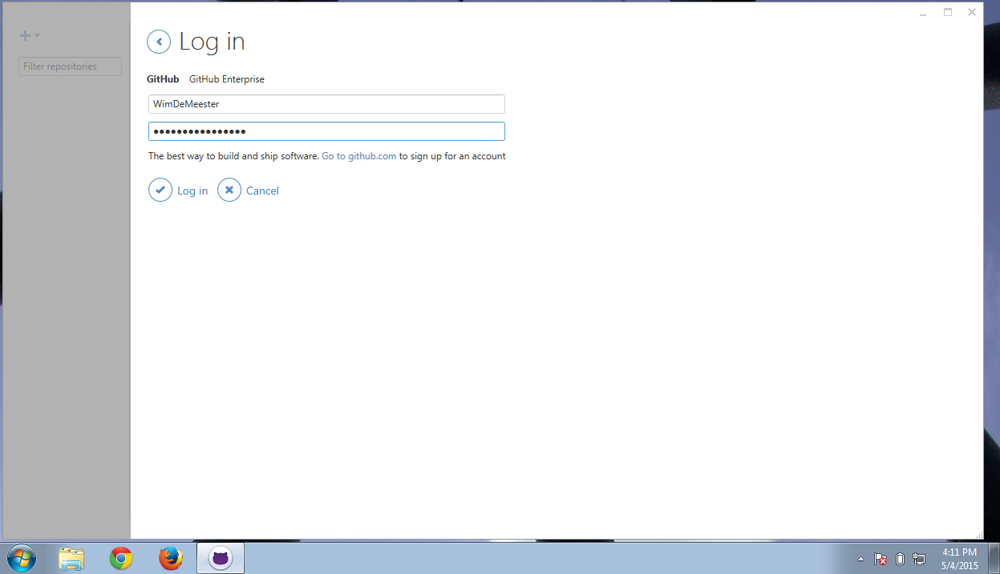
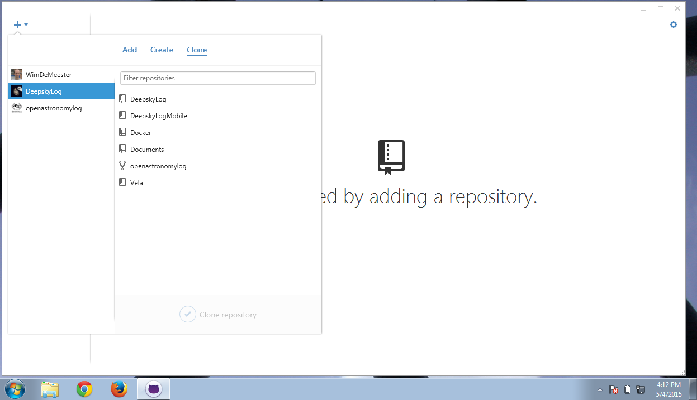
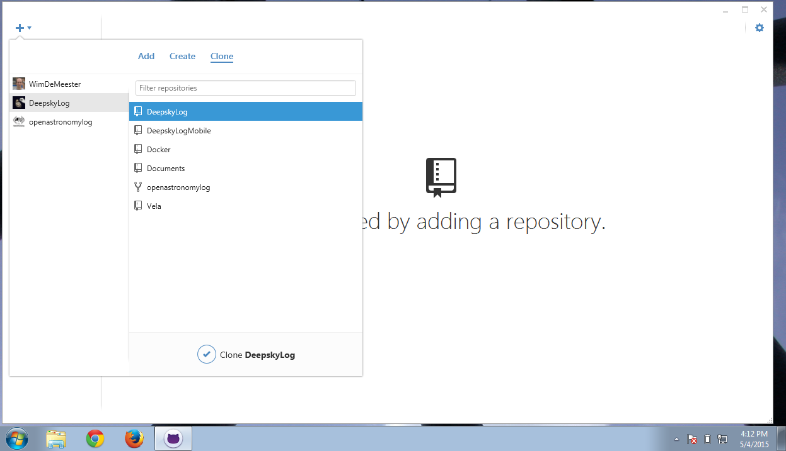
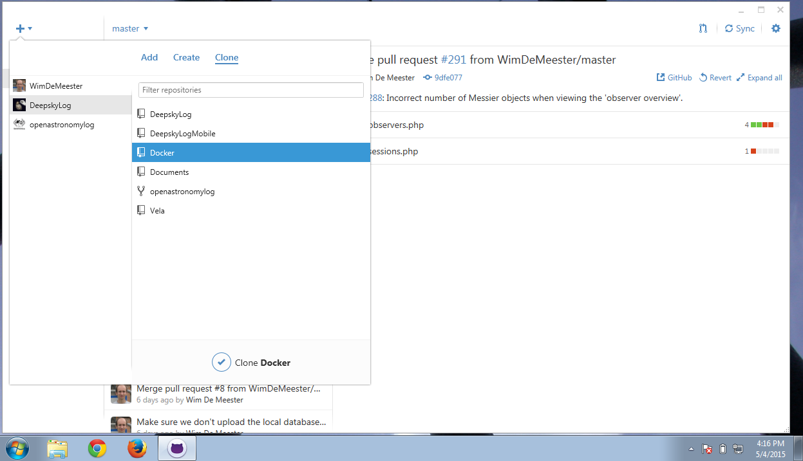
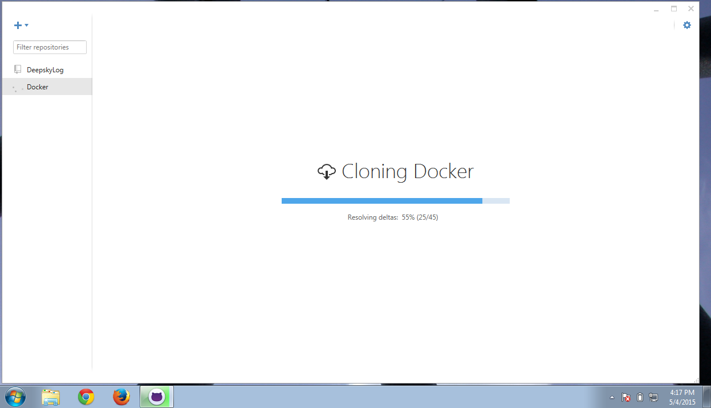

# Test DeepskyLog using Windows

This document describes how to set up your environment to be able to test the developer version of DeepskyLog locally on your Windows computer.

+ Download and install the GitHub software: https://windows.github.com/
+ Start the GitHub software
+ Go to the Options page (the wheel at the right top side of the window)

+ Click 'Add Account'

+ Enter your credentials and click 'Log In'

+ Click on the 'Plus' sign at the left top side of the window. Select 'Clone'.

+ Select DeepskyLog / DeepskyLog

+ You will see that the DeepskyLog repository is being cloned.

+ You will see the History of the DeepskyLog commits. Click on the 'Plus' sign again.

+ Clone DeepskyLog / Docker

