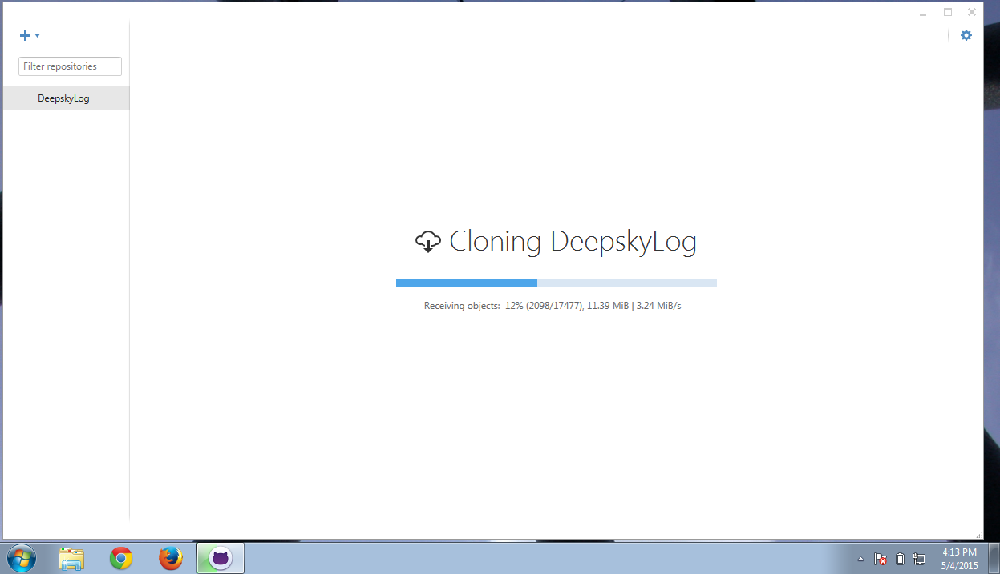
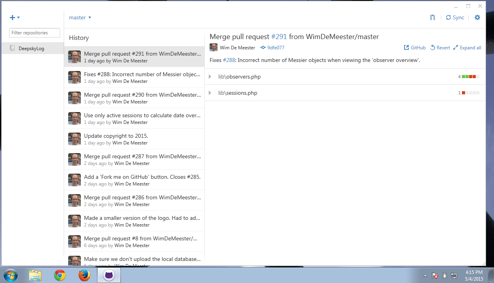

# Test DeepskyLog using Windows

This document describes how to set up your environment to be able to test the developer version of DeepskyLog locally on your Windows computer.

## Downloading the sourcecode

+ Download and install the GitHub software: https://desktop.github.com/
+ Start the GitHub software
+ Go to the Options page (the wheel at the right top side of the window)
+ Click 'Add Account'

+ Enter your credentials and click 'Log In'

+ Click on the 'Plus' sign at the left top side of the window. Select 'Clone'.

+ Select DeepskyLog / DeepskyLog

+ You will see that the DeepskyLog repository is being cloned.

+ You will see the History of the DeepskyLog commits. Click on the 'Plus' sign again.

+ Clone DeepskyLog / Docker

+ You will see that the Docker repository is being cloned.

## Setting up the test environment

+ Download and install Docker Toolbox: https://www.docker.com/toolbox/
+ Start up Docker Quickstart Terminal (by Double clicking the icon on the Desktop)

## Making the mysql Data Volume container
+ Switch to the directory with the Docker source code:
`cd Documents\GitHub\Docker\`
+ Make the container:
`docker build -t="mysql:v5.0" mysql-container`

## Run the Data Volume container
`docker run -d --name mysql mysql:v5.0 tail -f /dev/null`

## Making the DeepskyLog container
`docker build -t deepskylog:v5.0 .`
This will take a long time, so be patient. It only has to executed one time, so this is not problematic.

## Running the DeepskyLog container
`docker run -v \Users\wim\Documents\GitHub\DeepskyLog\:/var/www/html --volumes-from mysql -t -p 80:80 -p 3306:3306 deepskylog:v5.0`

Change `\Users\wim\Documents\GitHub\DeepskyLog\` with the location of the DeepskyLog source code. If you used the default settings of the GitHub client, you will only need to change the username.

## Find out the IP address of the webserver for DeepskyLog
`docker-machine.exe ip default`

## Make DeepskyLog work with the docker containers

In `Documents\GitHub\DeepskyLog\lib\setup\`, copy the file `databaseInfo.php.dist` to `databaseInfo.php` and enter the correct ip address in the following line:

`$baseURL      = "http://192.168.99.100/";`

## Test DeepskyLog

+ Before you can run DeepskyLog locally on your Windows machine, make sure that you startup `Docker Quickstart Terminal` and start up the docker container for DeepskyLog:
`docker run -v \Users\wim\Documents\GitHub\DeepskyLog\:/var/www/html --volumes-from mysql -t -p 80:80 -p 3306:3306 deepskylog:v5.0`
+ You can now test the developer version of DeepskyLog in your browser. Point to the IP address you used in the steps above: http://192.168.99.103/.
+ Make sure to update the source code of DeepskyLog once in a while. To do this, start up your GitHub client, select DeepskyLog and click 'Sync' (at the top right).
